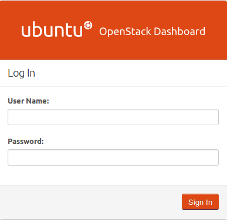

Horizon(Dashboard)
==================

.. toctree::
   :numbered: 


``OpenStack Dashboard (Horizon)`` provides administrators and users a graphical interface to access, provision and automate cloud-based resources. The dashboard is just one way to interact with OpenStack resources.

1. Install Horizon Packages
---------------------------
.. code:: bash

	#apt-get install apache2 memcached libapache2-mod-wsgi openstack-dashboard


2. Reload Apache and memcached
------------------------------
.. code:: bash

	#service apache2 restart; service memcached restart
You can now access your OpenStack ``192.168.0.12/horizon`` with credentials ``admin : admin_pass``. 


Graphical View of OpenStack Dashboar
````````````````````````````````````



